<div align="center">

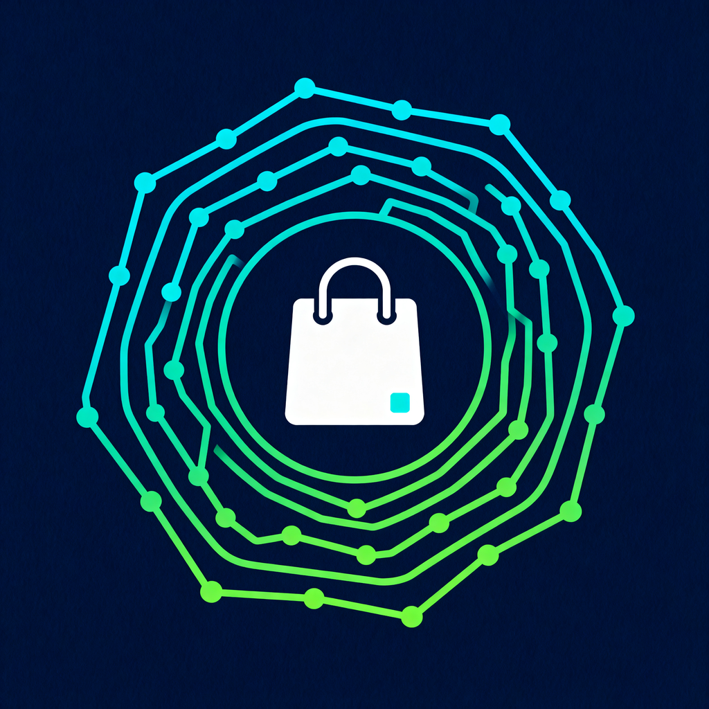

# TechNest

### A full-featured, production-ready Flutter e-commerce application

<p>
  
  
  
</p>
<p>
  
  
  
</p>

[Features](#-features) · [Architecture](#️-architecture) · [Screenshots](#-screenshots) · [Getting Started](#-getting-started) · [Tech Stack](#-tech-stack)

</div>

---

## 📖 Overview

**TechNest** is a full-featured, production-ready e-commerce mobile application built with Flutter. It delivers a smooth, modern shopping experience — from browsing and filtering products to placing orders with real-time push notifications.

The app is architecturally sound, leveraging **Clean Architecture** and **Cubit-based state management** to maintain a clear, scalable, and testable codebase. The backend is a **PHP REST API**, with **Firebase Cloud Messaging** powering the real-time notification system.

---

## ✨ Features

<details>
<summary><b>🔐 Authentication</b></summary>

- User registration with email verification (OTP via PIN input)
- Login with secure token storage
- Forgot password & reset password flow (email-triggered)
- Persistent session (auto-login on app restart)
- Automatic logout on `401 Unauthorized` response

</details>

<details>
<summary><b>🛒 Shopping Experience</b></summary>

- Product listing with skeleton loading states
- Product search with live suggestions
- Advanced filtering: by category, price range, sort order
- Infinite scroll / load-more pagination
- Product detail screen with full info and add-to-cart

</details>

<details>
<summary><b>🛍️ Cart & Checkout</b></summary>

- Add, remove, and update item quantities in cart
- Clear entire cart
- Checkout screen with order summary
- Google Maps location picker for delivery address
- Order placement via API

</details>

<details>
<summary><b>📦 Orders</b></summary>

- List all user orders
- View full order details
- Cancel a pending order

</details>

<details>
<summary><b>🔔 Push Notifications</b></summary>

- Firebase Cloud Messaging (FCM) integration
- Local notifications for foreground messages
- Notification inbox with mark-as-read support
- Deep linking from notification tap (`NEW_PRODUCT`, `ORDER`, `RESET_PASSWORD`)
- Topic subscription (`all_users`) for broadcast messages
- FCM token auto-synced to backend after login

</details>

<details>
<summary><b>🎨 UI & UX</b></summary>

- Material 3 design system
- Full **Light & Dark mode** support with persistence
- **Arabic (RTL) & English** localization via `slang`
- Custom page transitions (fade, slide, slide-up)
- Scale-tap micro-animations
- Shimmer skeleton loading effects
- Responsive error and empty state views

</details>

---

## 🏗️ Architecture

TechNest follows **Clean Architecture** with a strict unidirectional dependency rule:

```
Presentation  ──▶  Domain  ──▶  Data
```

Each feature is self-contained and composed of three layers:

| Layer | Responsibility |
|---|---|
| **Presentation** | UI (screens, widgets), Cubits for state management |
| **Domain** | Use cases, entities, abstract repository contracts — zero Flutter imports |
| **Data** | API data sources, JSON models, repository implementations |

---

## 🧠 State Management

TechNest uses **Cubit** (from `flutter_bloc`) exclusively for business state.

- Every Cubit depends only on **use cases** — never directly on repositories or data sources.
- States are modeled as **sealed classes** with exhaustive `switch` expressions in the UI.
- Global Cubits (`ThemeCubit`, `LocaleCubit`) are registered as lazy singletons at the app root.
- Feature Cubits are registered as factories and scoped to their route via `BlocProvider`.

---

## 🔌 API & Networking

- All HTTP communication goes through the abstract `ApiClient` interface, implemented by `DioClient`.
- **Base URL** is injected at build time via `--dart-define=BASE_URL`.
- Three Dio interceptors run on every request:

| Interceptor | Purpose |
|---|---|
| `AuthInterceptor` | Reads auth token from secure storage and injects it as a request header |
| `LocaleInterceptor` | Appends the active locale for backend i18n |
| `ErrorInterceptor` | Catches 401 responses, deletes local token, triggers automatic logout |

---

## ⚠️ Error Handling

A typed exception/failure hierarchy ensures errors never silently bubble to the UI.

```
API / Storage  →  Exception  →  Failure  →  ApiResult<T>  →  Cubit State  →  UI
```

| Exception | Cause |
|---|---|
| `NetworkException` | No connectivity |
| `ServerException` | HTTP 4xx / 5xx with optional user-facing message |
| `UnAuthorizedException` | HTTP 401 |
| `CacheException` | SharedPreferences / SecureStorage failure |
| `UnKnownException` | Unhandled/unexpected errors |

```dart
sealed class ApiResult<T> {
  R fold<R>(R Function(Failure) ifLeft, R Function(T) ifRight);
}
class ApiSuccess<T> extends ApiResult<T> { final T data; }
class ApiFailure<T> extends ApiResult<T> { final Failure failure; }
```

---

## 🔔 Notifications System

### FCM Integration

Handles all three app states:

| App State | Behavior |
|---|---|
| **Foreground** | FCM message received → shown via `flutter_local_notifications` |
| **Background** | Tapped notification → `onMessageOpenedApp` fires the deep-link handler |
| **Terminated** | `getInitialMessage()` checked on startup → deep-link handler called |

### Deep Linking via Strategy Pattern

| Notification Type | Handler | Action |
|---|---|---|
| `NEW_PRODUCT` | `NewProductNotificationHandler` | Navigate to product details |
| `ORDER` | `OrderNotificationHandler` | Navigate to order details |
| `RESET_PASSWORD` | `ResetPasswordNotificationHandler` | Navigate to reset password |

---

## 🏛️ Design Patterns

| Pattern | Where Used |
|---|---|
| **Repository** | `domain/repositories/` (abstract) + `data/repositories/` (concrete) |
| **Factory** | `NotificationHandlerFactory` — maps notification type → handler |
| **Strategy** | `NotificationHandler` abstract class with pluggable implementations |
| **Service Locator** | `get_it` for all dependency wiring |
| **Interceptor** | Dio interceptors for auth, locale, and error handling |
| **Sealed Class / ADT** | `ApiResult<T>` and all Cubit states |

---

## 🌍 Localization

The app supports **Arabic (RTL)** and **English** using the [`slang`](https://pub.dev/packages/slang) package.

- Type-safe Dart accessors generated from `en.i18n.json` and `ar.i18n.json` — no raw string keys in the UI.
- Active locale persisted via `SharedPreferences` and restored on startup.
- `LocaleInterceptor` forwards the current locale to the API for server-side localized error messages.

---

## 🗺️ Navigation

Navigation is handled entirely by **`go_router`** with named routes only.

- A `StatefulShellRoute` drives the bottom navigation bar with 6 branches: Home, Cart, Categories, Orders, Notifications, and Settings.
- Auth guard logic enforces:
  - First launch → **Onboarding**
  - Unauthenticated → **Login**
  - Authenticated + on auth route → **Home**

---

## 📸 Screenshots
 
| Onboarding | Login | Home |
|:---:|:---:|:---:|
| 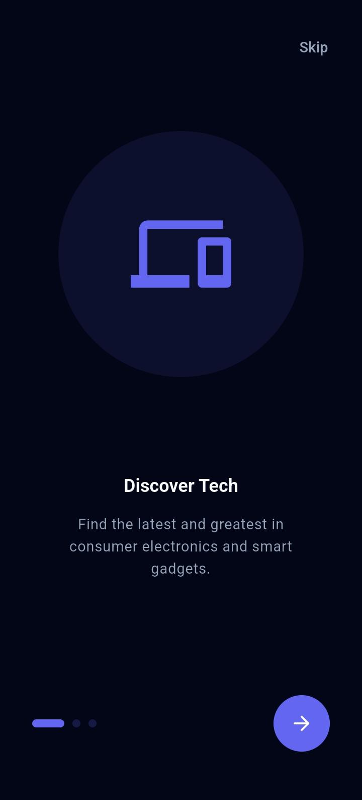 | 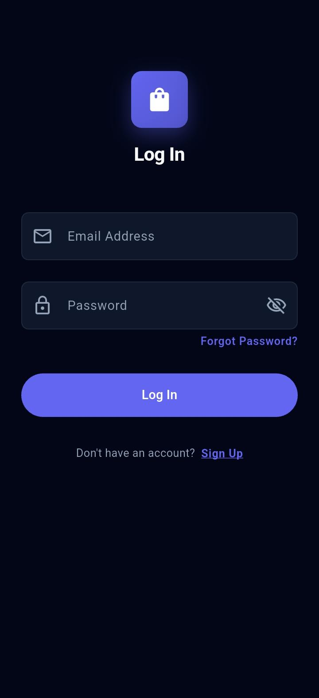 | 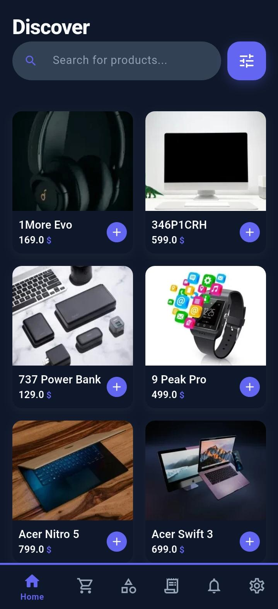 |
 
| Categories | Product Details | Cart |
|:---:|:---:|:---:|
| 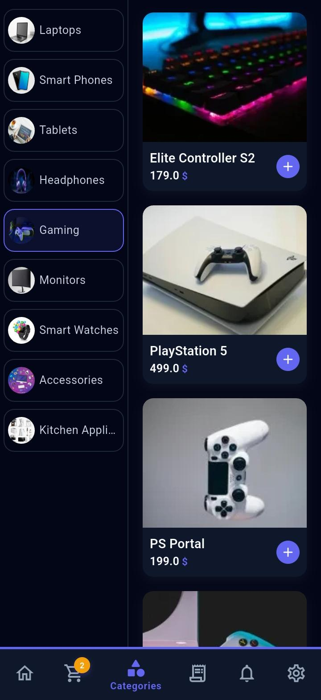 |  | 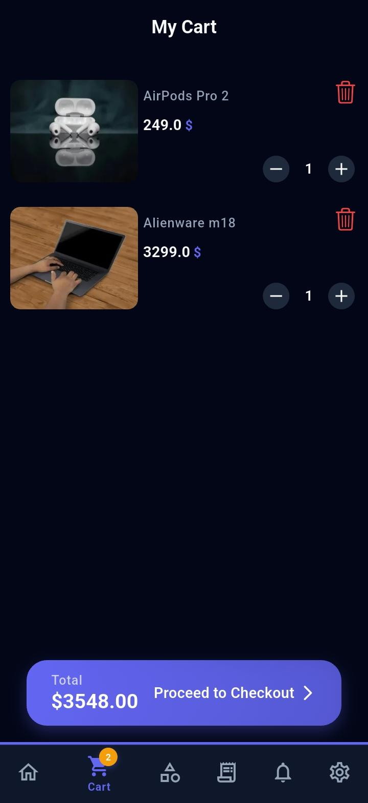 |
 
| Orders | Order Details | Notifications |
|:---:|:---:|:---:|
| 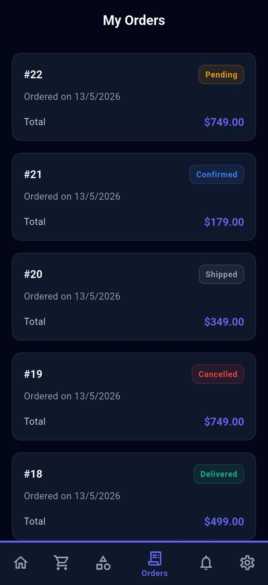 | 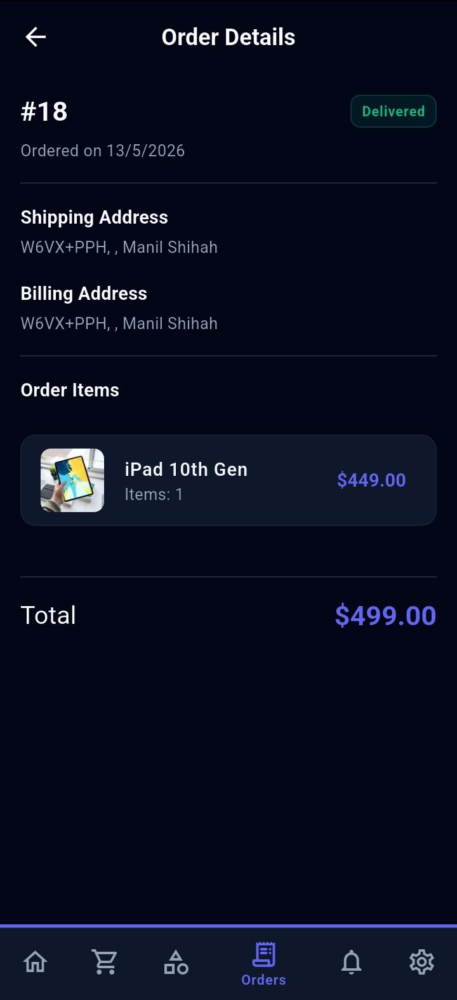 | 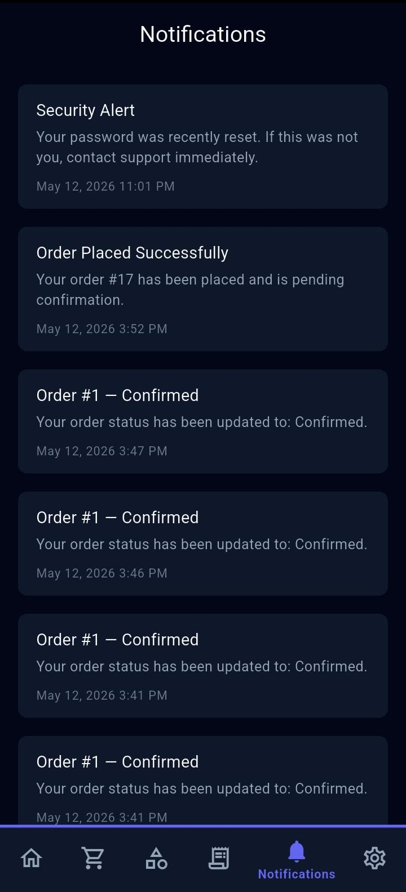 |
 
| Filter | Reset Password | Signup |
|:---:|:---:|:---:|
| 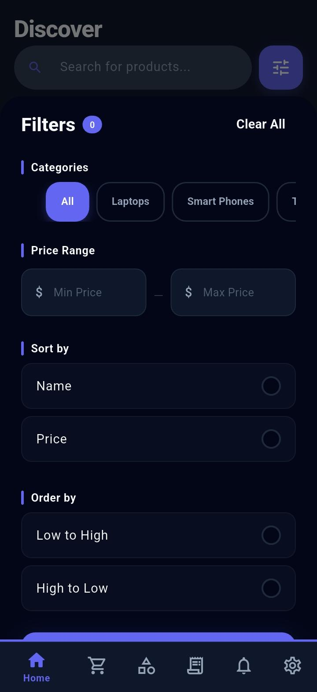 | 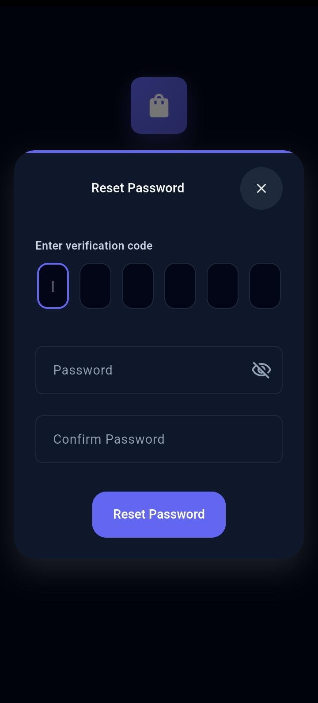 | 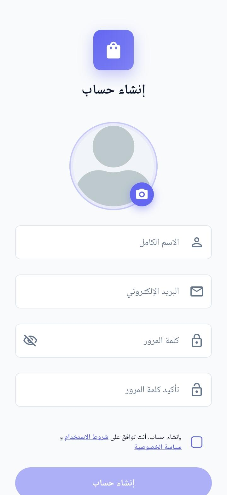 |
 
| Home | Categories | Cart |
|:---:|:---:|:---:|
| 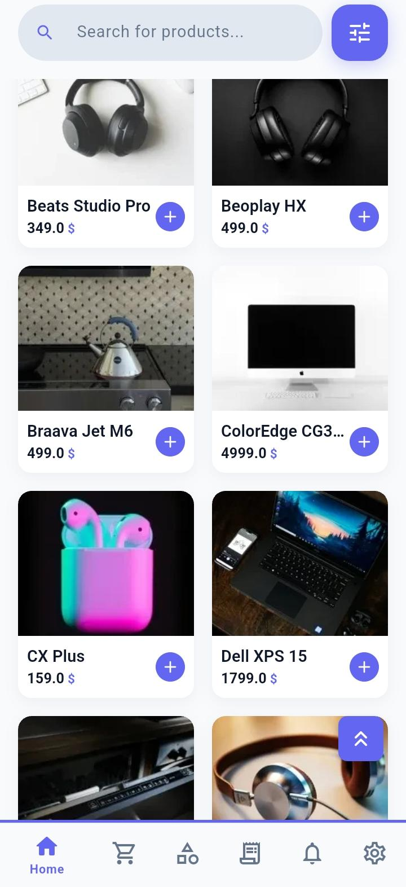 | 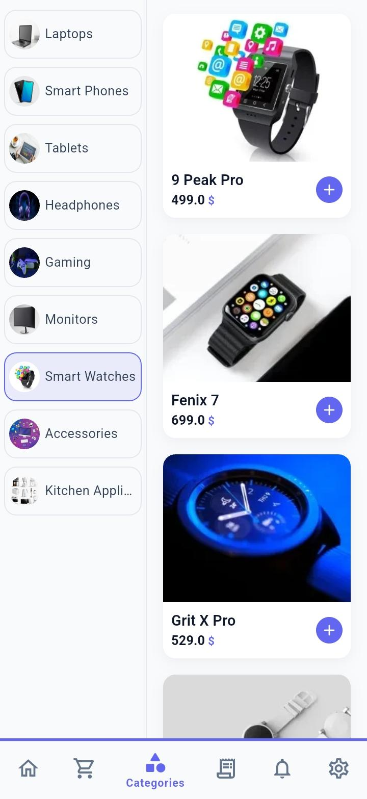 | 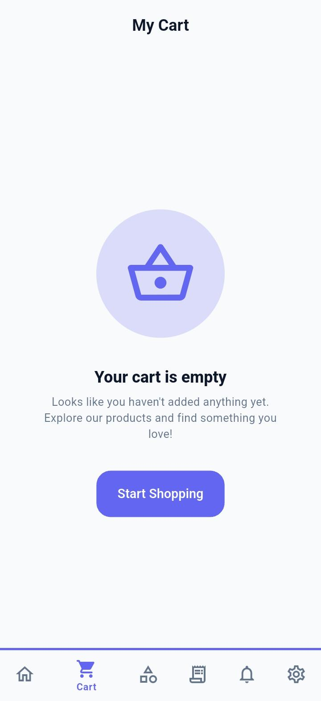 |
 
| Filter | Logout | Order Details |
|:---:|:---:|:---:|
| 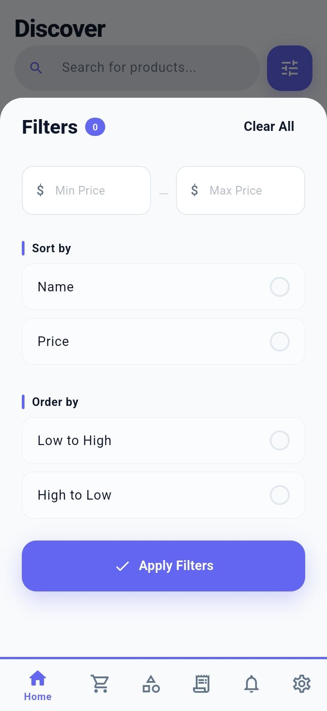 | 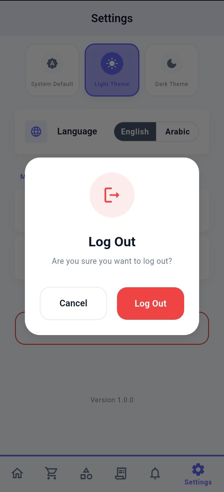 |  |
 
 
| Home | Categories | Checkout |
|:---:|:---:|:---:|
| 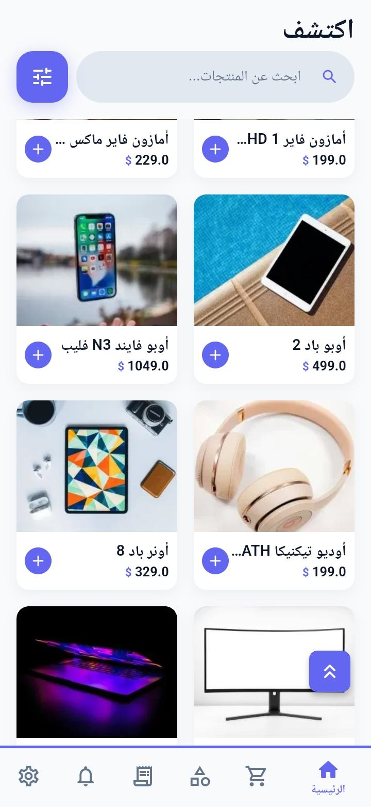 | 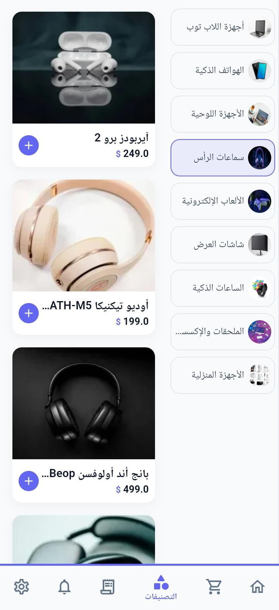 | 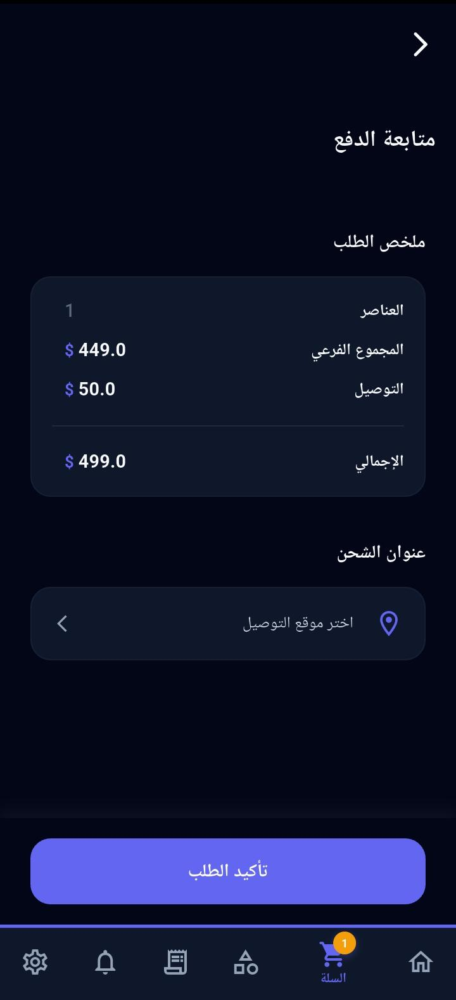 |
 
| Pick Location | Settings |
|:---:|:---:| 
| 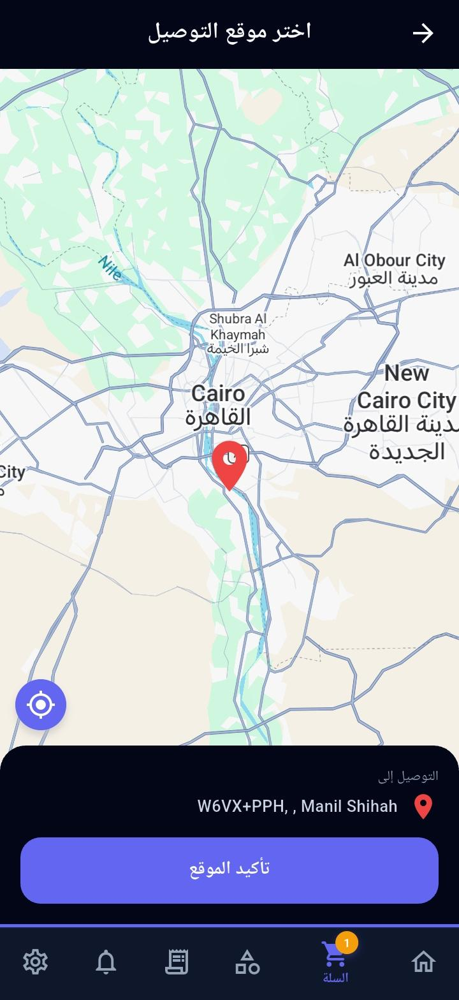 | 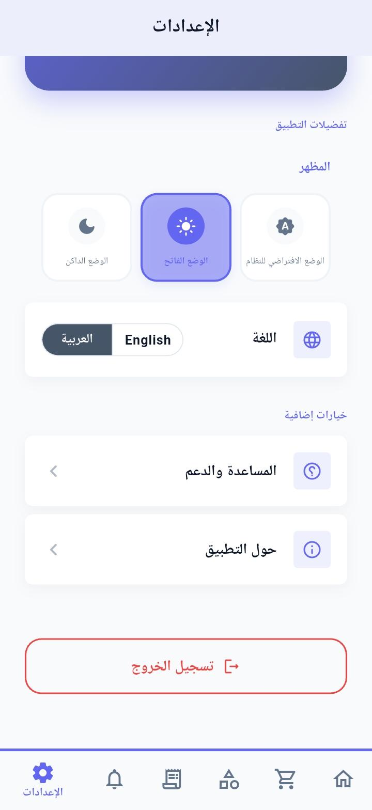 |
 
---

## 🧰 Tech Stack

| Category | Technology |
|---|---|
| **Framework** | Flutter (Dart `^3.11.0`) |
| **State Management** | `flutter_bloc` ^9.1.1 |
| **Dependency Injection** | `get_it` ^9.2.1 |
| **Navigation** | `go_router` ^17.1.0 |
| **Networking** | `dio` ^5.9.2 |
| **Firebase** | `firebase_core` ^4.7.0, `firebase_messaging` ^16.2.0 |
| **Local Notifications** | `flutter_local_notifications` ^21.0.0 |
| **Secure Storage** | `flutter_secure_storage` ^10.0.0 |
| **Cache** | `shared_preferences` ^2.5.4 |
| **Localization** | `slang` ^4.14.0 + `slang_flutter` |
| **Maps & Location** | `google_maps_flutter` ^2.17.0, `geolocator` ^14.0.2, `geocoding` ^4.0.0 |
| **Image Loading** | `cached_network_image` ^3.4.1 |
| **Skeleton Loading** | `skeletonizer` ^2.1.3 |
| **OTP Input** | `pinput` ^6.0.2 |
| **Equality** | `equatable` ^2.0.8 |

---

## 🚀 Getting Started

### Prerequisites

| Tool | Version |
|---|---|
| Flutter SDK | `>=3.11.0` (beta channel) |
| Dart SDK | `>=3.0.0` |
| Android Studio / Xcode | Latest stable |
| Firebase project | Required |

### 1. Clone the Repository

```bash
git clone https://github.com/<marwan-gharib>/tech_nest.git
cd tech_nest
```

### 2. Install Dependencies

```bash
flutter pub get
```

### 3. Configure Firebase

1. Create a Firebase project at [console.firebase.google.com](https://console.firebase.google.com)
2. Enable **Firebase Cloud Messaging**
3. Add `google-services.json` (Android) and `GoogleService-Info.plist` (iOS) to their respective platform directories
4. `firebase_options.dart` is already generated — **do not commit secret keys**

### 4. Set the Backend URL

The API base URL is injected at **build time** via `--dart-define` — no `.env` files, no secrets in source control.

| Variable | Description | Default |
|---|---|---|
| `BASE_URL` | Root URL of your backend server (Local Server) | `http://[IP_ADDRESS]` |

The full API path resolves as:
```
{BASE_URL}/tech-nest-backend/api/user/
```

### 5. Run the App

```bash
# Development with custom base URL
flutter run --dart-define=BASE_URL=http://<your-server-ip>

# Using the default base URL
flutter run

# Release build
flutter build apk --dart-define=BASE_URL=https://your-production-domain.com
```

> ⚠️ **Security:** Auth tokens are stored exclusively in `FlutterSecureStorage` (OS keychain / Keystore). Never hardcode secrets.

---

## 🔮 Future Work

- [ ] Wishlist / favorites feature
- [ ] Product ratings and reviews
- [ ] Payment gateway integration (Stripe / PayPal)
- [ ] Real-time order tracking
- [ ] Profile management (avatar upload, personal info)
- [ ] Search history persistence
- [ ] Web platform support (responsive layouts)
- [ ] CI/CD pipeline with GitHub Actions

---

## 📁 Backend

TechNest's backend is a **PHP REST API** serving JSON responses, consumed exclusively through the `ApiClient` abstraction.

> Backend repository:  https://github.com/marwan-gharib/tech-nest-backend

---

## 🤝 Contributing

1. Fork the repository
2. Create a feature branch: `git checkout -b feat/your-feature`
3. Commit your changes following [Conventional Commits](https://www.conventionalcommits.org/)
4. Push and open a Pull Request

---

## 📄 License

This project is licensed under the **MIT License** — see the [LICENSE](https://github.com/marwan-gharib/tech-nest/blob/main/LICENSE) file for details.
